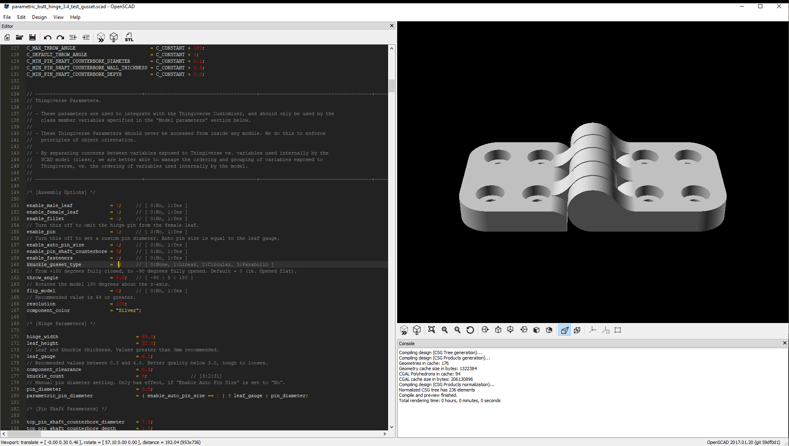
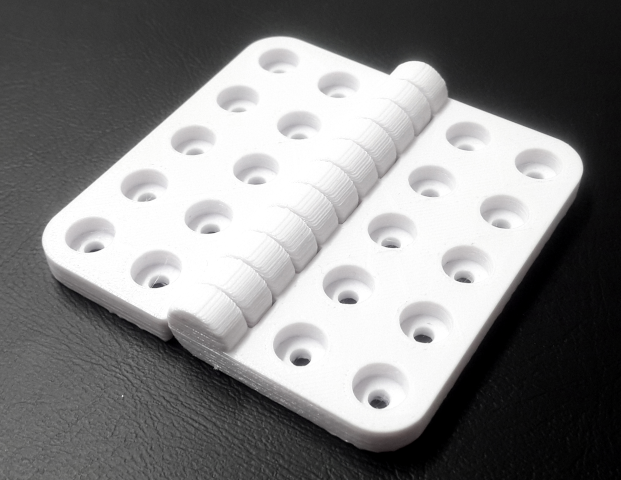

# OpenSCAD - 3D Printing Projects

## Parametric Butt Hinge
Thingiverse URL: [www.thingiverse.com/thing:2187167](https://www.thingiverse.com/thing:2187167)
### Gusset Parameters

#### Parabolic

- Initialize input values.

$$w \quad \text{...Gusset width.}$$
  
$$h \quad \text{...Hinge leaf height.}$$

$$r \quad \text{...Knuckle radius is equal to the leaf gauge.}$$
 
$$g \quad \text{...Leafe gauge.}$$

- Compute the parabolic point of contact with the knuckle cylinder.

$$s = w \space + \space r \quad \text{...Cartesian position of the point where the gusset curve merges with the leaf.}$$

$$i = \sqrt { 8 \cdot r^2 + s^2 } \quad \text{...Common root.}$$

$$x = \dfrac{ i - s }{2} \quad \text{...x intercept.}$$

$$y = \sqrt { r^2 - x^2 } \quad \text{...y intercept.}$$

- Compute coefficient $a$ of vertex form parabola.

$$a_n = \sqrt[4]{ 2 } \cdot \sqrt[4]{ s \cdot ( i - s ) - 2 \cdot r^2 } \quad \text{...Numerator}.$$

$$a_d = \sqrt{ s \cdot ( 5 \cdot s - 3 \cdot i ) + 4 \cdot r^2 } \quad \text{...Denominator.}$$

$$a = \dfrac{a_n}{a_d}$$

$$y = a^2 \cdot ( x - s )^2$$

#### Circular

- Input values:

$$w = \text{Gusset width}$$

$$g = \text{Knuckle radius}$$

- Compute gusset radius: 
  The radius of the circle, that is tangential to the knuckle cylinder.

$$r = \dfrac{ 2 \cdot g \cdot w \space + \space w^2}{ 2 \cdot g}$$

- Compute gusset height: 
  The point of intersection between the knuckle cylinder and the gusset cutter.

$$h = \dfrac{ g \cdot r }{ \sqrt{ 2 \cdot g \cdot w \space + \space g^2 \space + \space r^2 \space + \space w^2 } }$$

- Compute the intersection point between the knuckle and gusset cutting tool, using gusset height: 
  The coordinates of the intersection point are, $p(x,h)$, where $h$ is the vertical value of the coordinate.

$$x = \dfrac{ h \cdot ( g \space + \space w ) }{ r }$$

#### Linear

#### None

### Sample Prints
|  |  |  |
| - | - | - |
|  |  |  |

  
