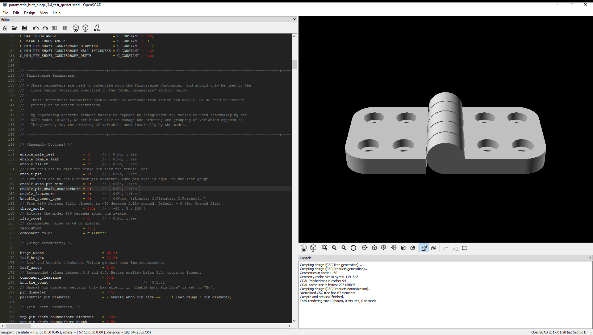
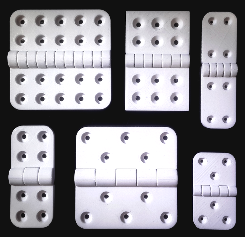

# OpenSCAD - 3D Printing Projects

## Parametric Butt Hinge
Thingiverse URL: [www.thingiverse.com/thing:2187167](https://www.thingiverse.com/thing:2187167)
### Gusset Parameters

### Parabolic

- Initialize input values.

$$w = \text{Gusset width}$$

$$h = \text{Hinge leaf height}$$

$$r = \text{Knuckle radius is equal to the leaf gauge}$$

$$s = w \space + \space r \space \text{...Cartesian position of the point where the gusset curve merges with the leaf}$$

$$g = \text{Leafe gauge}$$

// Compute the parabolic point of contact with the knuckle cylinder.

i  = sqrt ( 8.0*r*r + s*s );    // Common root.
x  = ( i - s )/2.0;             // x intercept.
y  = sqrt ( r*r - x*x );        // y intercept.

// Compute coefficient 'a' of vertex form parabola.
//
//      2      2 
// y = a  (x-s)

an = root4 ( 2.0 ) * root4 ( s*( i - s ) - 2.0*r*r );   // Numerator.
ad = sqrt ( s*( 5.0*s - 3.0*i ) + 4.0*r*r );            // Denominator.
a  = an / ad;  

### Circular

- Input values:

$$w = \text{Gusset width}$$

$$g = \text{Knuckle radius}$$

- Compute gusset radius: 
  The radius of the circle, that is tangential to the knuckle cylinder.

$$r = \dfrac{ 2 \cdot g \cdot w \space + \space w^2}{ 2 \cdot g}$$

- Compute gusset height: 
  The point of intersection between the knuckle cylinder and the gusset cutter.

$$h = \dfrac{ g \cdot r }{ \sqrt{ 2 \cdot g \cdot w \space + \space g^2 \space + \space r^2 \space + \space w^2 } }$$

- Compute the intersection point between the knuckle and gusset cutting tool, using gusset height: 
  The coordinates of the intersection point are, $p(x,h)$, where $h$ is the vertical value of the coordinate.

$$x = \dfrac{ h \cdot ( g \space + \space w ) }{ r }$$

### Linear

### None

### Sample Prints
|  |  |  |
| - | - | - |
|  |  |  |

  
